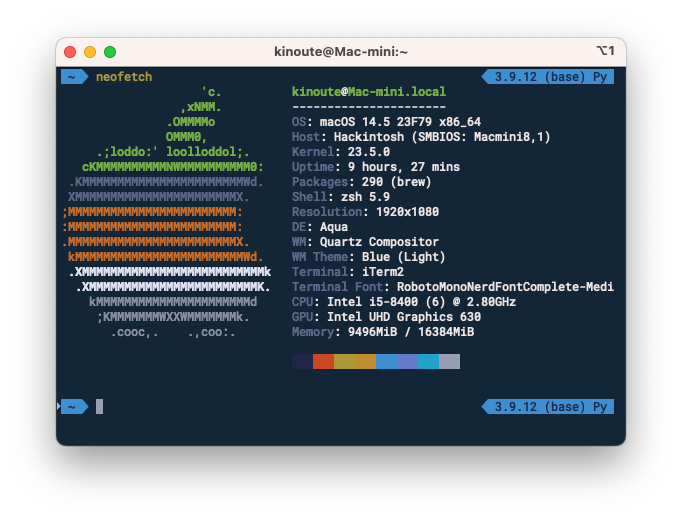
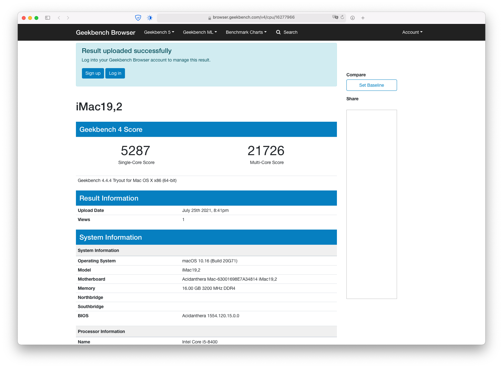

# Hackintosh

A Hackintosh running macOS Monterey 12.3.1 with a i5-8400 and a Gigabyte Z370-HD3P.



## Status

### Feb 3rd, 2022: Big Sur to Monterey (OpenCore 0.7.7)

I was able to upgrade from Big Sur to macOS Monterey 12.2 and OC 0.7.7 at the same time. I had to switch back from `iMac19,2` to `Macmini8,1` as SMBIOS to make my DVI work again. Don't forget to generate new serials if you do that change too.

You can download the final EFI Folder for Big Sur 11.6.3 with OpenCore 0.7.6 [here](https://github.com/kinoute/Hack-Z370-HD3P-i5-8400/releases/tag/v4.0) or browse the repo for this old version [here](https://github.com/kinoute/Hack-Z370-HD3P-i5-8400/tree/opencore-bigsur-11-6-3).

### Dec 19th, 2021: Upgrade OpenCore from 0.7.1 to 0.7.6

In order to prepare the installation of macOS 12 Monterey, I spent a few time upgrading OpenCore to the latest version as today, which is 0.7.6. If everything works correctly, I will upgrade macOS in the following weeks.

### Aug 7th, 2021: Catalina to Big Sur (OpenCore)

I smoothly made the upgrade to macOS Big Sur 11.5.1 through the System Preferences after a few days on Catalina and OpenCore. You can download the final EFI Folder running Catalina 10.15.7 with OpenCore 0.7.1 [here](https://github.com/kinoute/Hack-Z370-HD3P-i5-8400/releases/tag/v3.0) or browse the repo for this old version [here](https://github.com/kinoute/Hack-Z370-HD3P-i5-8400/tree/opencore-catalina-10-15-7).

### Jul 24th, 2021: Clover to OpenCore 0.7.1 (Catalina)

I finally switched from Clover to OpenCore in order to prepare the upgrade to macOS Big Sur in a few weeks (if everything is stable). You can find the final EFI Folder running Clover for Catalina 10.15.7 [here](https://github.com/kinoute/Hack-Z370-HD3P-i5-8400/releases/tag/v2.0) or browse the repo for this old version [here](https://github.com/kinoute/Hack-Z370-HD3P-i5-8400/tree/clover-catalina-10-15-7).

### Aug 18th, 2020: Mojave to Catalina (Clover)

I recently updated my Hackintosh from Mojave 10.14.6 to Catalina 10.15.7. You can find the latest and final EFI Folder for Mojave [here](https://github.com/kinoute/Hack-Z370-HD3P-i5-8400/releases/tag/v1.0) and browse the repo for this version [here](https://github.com/kinoute/Hack-Z370-HD3P-i5-8400/tree/fe1f54f0f4857de386408216621432f3969e7c6b).

If you're curious, I changed two things in my `config.plist` to fix Catalina:

* I added `igfxonln=1` to the boot arguments because I was getting a black screen after waking up from sleep. It fixed the problem but AppleALC, the kext that handles the Audio, was crashing my system (Kernel Panic) after waking up.
* To avoid the Kernel Panic after waking up, I had to disable the audio through HDMI. Since I don't use it, it was not a problem. To do that, I set-up the  `No-hda-gfx` property in my `config.plist` file. It fixed the issue.

**Important:** If you wish to upgrade to Catalina just like I did, don't forget to install/use a recent version of Clover, at least Clover v5.0 r5107. I personally use [Clover v5.0 r5119](https://github.com/Dids/clover-builder/releases/tag/v5.0_r5119).

## Motivation

I built my Hackintosh because I was disappointed with the price of the new Mac Mini 2018. Its configuration is close to the new mid-entry Mac Mini but with more RAM (16 instead of 8 Gb). Here are the specs:

- macOS Monterey 12.3.1
- Intel i5-8400 (6 cores @ 2.80 Ghz, 3.80 Ghz Turbo Boost)
- Gigabyte Z370-HD3P
- Corsair Vengeance LPX 16Gb (2x8Gb) DDR4 2666MHz OC @ 3200 Mhz (CMK16GX4M2A2666C16)
- EVGA 600 W1, 80+ WHITE 600W
- SSD SAMSUNG 830 Series 256 Gb
- Various old HDDs
- Apple Wired Keyboard
- Microsoft Wireless Mobile Mouse 1000
- M-Audio Fast Track Pro
- Yamaha HS5
- Philips 244E 24" 1080p monitor

## Installation

The installation was pretty straight forward. If you go like me with only the integrated Intel GPU (UHD 630), a Coffee Lake CPU, and this motherboard, just follow the [vanilla guide](https://dortania.github.io/OpenCore-Install-Guide/) and read the "Coffee Lake" page carefully.

You can copy my `EFI` folder to your EFI Partition which should work directly. Don't forget to enter your own Serial Number, SystemUUID and MLB. I recommend [ProperTree](https://github.com/corpnewt/ProperTree) to edit the `config.plist` file and enter your own values (these fields are empty in the given config and must be populated to make it work).

## BIOS

I'm running the BIOS **F14a** version. You can find my BIOS Settings with pictures [here](BIOS/README.md). 

## My EFI

* **OpenCore version**: v0.7.9
* **UEFI Drivers** (now located in `EFI/OC/Drivers`):
    - _OpenCanopy.efi_
    - _OpenRuntime.efi_
    - _HFSPlus.efi_
* **Kexts** (in `EFI/OC/Kexts`):
    - _AppleALC.kext_
    - _CtlnaAHCIPort.kext_
    - _IntelMausi.kext_
    - _Lilu.kext_
    - _SMCProcessor.kext_
    - _SMCSuperIO.kext_
    - _VirtualSMC.kext_
    - _WhateverGreen.kext_
    - _USBPorts.kext_

If you use my EFI folder & BIOS Settings, you need to generate by yourself your serials and put them in the `config.plist`. You can use [macserial](https://github.com/acidanthera/macserial) or [GenSMBIOS](https://github.com/corpnewt/GenSMBIOS) to generate serials for the model you picked.

I first chose `Macmini8,1` because my config was similar to the new Mac Mini model but I recently changed my SMBIOS to `iMac19,2` due to the black screen issue I was having while watching videos in full screen. (**Update:** Apparently this was a bug on macOS and it has been fixed in 10.14.6).

`iMac19,2` seems better for power management and upgradability (in case you want to add a dedicated GPU later). This is the SMBIOS used in this config up to Big Sur. For Monterey, I had to switch back to `Macmini8,1` to make my DVI port work again.

## What works

* UHD 630 Integrated Graphics
* Turbo Boost
* Ethernet
* USB 2 / USB 3 Ports (see [USB Ports](#usb-ports))
* HDMI Out
* DVI-D Out
* Sleep / Wake up
* Sound (see [Sound](#Sound))

## USB Ports

I created my own kext with Hackintool to map all the USB Ports on the back of the motherboard. You can find it in my EFI folder, it's called *USBPorts.kext*. **You don't need _USBInjectAll_ or the patch limit anymore**.

Both USB 2 and USB 3 ports are working. The USB 3.1 port is also working OOTB. For USB 3 ports, you can also use USB 2 devices on them, it will work. Here are all the ports enabled and working (except USB-C, not tested):


If you have a case with USB ports on front or if you want to use an internal card for bluetooth, you will have to edit my kext to enable them. You then might have to choose exactly what ports you want to be able to use because you will quickly reach the 15 ports limit.

## Sound

As I mentioned in my setup above, I use a USB Audio interface for input/output. Therefore, I don't use that much (almost never) the inputs/outputs provided on the back of the motherboard.

Nevertheless, this repo should allow you to use sound I/O provided by the motherboard without any problem. 

With the AppleALC layout id set to "1" (already done in my `config.plist`), I was able to use:

* my headphones ;
* a microphone ;
* also the "Line In" to send music from my smartphone to macOS.

To use the sound inputs/ouputs of this motherboard, I did:

* Set `alcid` clover boot options to "1" (already done here) ;
* Use the "Pink" input (Mic In) for my microphone (and set "Built-in Microphone" in macOS Sound Settings) ;
* Use the "Green" input (Line Out) for my headphones (and set "Built-in Speakers" in macOS Sound Settings) ;
* Use the "Blue" input (Line In) to send sound to my Hack ("Built-in Line In" in macOS).


## Font on non-retina displays

For some people, after upgrading to Catalina, the font can look blurry or too thin on non-retina displays. I use a very old 24" 1080p monitor and I encountered this problem.

To get a somewhat similar font rendering as before, you can use the following two command lines that you have to type in your Terminal:

```bash
defaults -currentHost delete -globalDomain AppleFontSmoothing
defaults write -g CGFontRenderingFontSmoothingDisabled -bool YES
```

Then restart your Hackintosh. It should look better.

## Benchmarks



Link: https://browser.geekbench.com/v4/cpu/16277966

